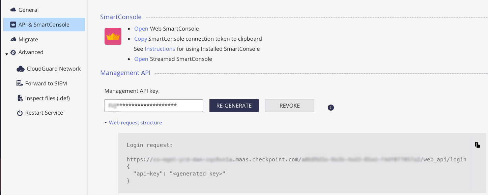

# Check Point Quantum Management MCP Server

## What is MCP?

The Model Context Protocol (MCP) is a standardized interface that allows AI agents and automation tools to interact programmatically with Check Point Quantum Management servers. Using MCP, you can:

- Query and visualize installed policies, rulebases, and network topology
- Retrieve and analyze access, NAT, and threat prevention rules
- List and inspect objects such as hosts, networks, services, VPN communities, and more


## Demo

<!-- Place a link or embed for a demo video here -->

## Use Cases

### Helps ensure regulatory compliance with industry standards.
Prompt: Check if my gateway configuration meets PCI-DSS/HIPAA/GDPR requirements.
 
### Find broad-definition rules
Prompt: List all firewall rules that allow traffic from any source to any destination on any port. Highlight rules that are disabled or unused.

### Source -> Destination Path Analysis 
Prompt: Can you check in my policy if HOST/Network can access the internet?

### Recommendation for rulebase optimization
Prompt: Take a look at the internet facing rules in my policy and suggest improvements. Are there any rules that you think I should strengthen or loosen. Consider both security risks and time wasting. In your recommendations, only refer to specific rules that you think can be changed, or offer to add new rules.

### Custom policy visualizations
Prompt: Please create a visual report that shows which services are allowed in my network, under which conditions, and which services are strictly blocked.


## Configuration Options

This server supports two main modes of authentication:

### 1. Smart-1 Cloud (API Key)

Authenticate to Check Point Smart-1 Cloud using an API key.

- **How to generate an API key:**
  In your SmartOne Cloud dashboard, go to Settings -> API & SmartConsole and genrate an API Key. 
  Copy the key and the server login URL (without the "login" suffix) to your client settings.
  


Set the following environment variables for Smart-1 Cloud:

- `API_KEY`: Your Smart-1 Cloud API key
- `S1C_URL`: Your Smart-1 Cloud Tenant "Web-API" URL

---

### 2. On-Prem Management (API Key or Username/Password)


Authenticate to an on-premises Security Management Server using either an API key or username/password.

- **How to create an administrator and credentials:**
  - Follow the official instructions here: [Managing Administrator Accounts (Check Point R81+)](https://sc1.checkpoint.com/documents/R81/WebAdminGuides/EN/CP_R81_SecurityManagement_AdminGuide/Topics-SECMG/Managing_Administrator_Accounts.htm)
  - When creating the administrator, set the desired permissions for API access and management operations.
  - You can authenticate using either an API key (recommended for automation) or username/password credentials.

Set the following environment variables:

- `API_KEY`: Your management API key (if using API key authentication)
- `MANAGEMENT_HOST`: The IP or hostname of your management server
- `PORT`: (Optional) Management server port (default: 443)
- `USERNAME`: (Optional) Username for authentication
- `PASSWORD`: (Optional) Password for authentication

---
## Client Configuration

This server can be used with Claude Desktop, Cursor, GitHub Copilot MCP integrations or any other MCP. Use the appropriate configuration for your environment:

### Smart-1 Cloud Example

```json
{
  "mcpServers": {
    "quantum-management": {
      "command": "npx",
      "args": ["@chkp/quantum_management_mcp"],
      "env": {
        "API_KEY": "YOUR_API_KEY",
        "S1C_URL": "YOUR_S1C_URL" //https://xxxxxxxx.maas.checkpoint.com/yyyyyyy/web_api
      }
    }
  }
}
```

### On-Prem Management Example

```json
{
  "mcpServers": {
    "quantum-management": {
      "command": "npx",
      "args": ["@chkp/quantum_management_mcp"],
      "env": {
        "MANAGEMENT_HOST": "YOUR_MANAGEMENT_IP_OR_HOST_NAME", 
        "MANAGEMENT_PORT": "443", // optional, default is 443
        "API_KEY": "YOUR_API_KEY", // or use USERNAME and PASSWORD
        "USERNAME": "YOUR_USERNAME", // optional
        "PASSWORD": "YOUR_PASSWORD"  // optional
      }
    }
  }
}
```

> Set only the environment variables required for your authentication method (see above for details).

### Configuring the Claude Desktop app 
For macOS:
### Create the config file if it doesn't exist
touch "$HOME/Library/Application Support/Claude/claude_desktop_config.json"

### Opens the config file in TextEdit 
open -e "$HOME/Library/Application Support/Claude/claude_desktop_config.json"

### For Windows:
code %APPDATA%\Claude\claude_desktop_config.json

### Add the server configuration:

```json
{
  "mcpServers": {
    "quantum-management": {
      "command": "npx",
      "args": ["@chkp/quantum_management_mcp"],
      "env": {
        Add the configuration from the above instructions
      }
    }
  }
}
```
## Development

### Prerequisites

- Node.js 18+
- npm 8+

### Setup

```bash
# Install all dependencies
npm install
```

### Build

```bash
# Build all packages
npm run build
```

### Running Locally

You can run the server locally for development:

```bash
npm run start
# or
npx ts-node src/index.ts
```

---
## ⚠️ Security Notice

1. **Authentication keys and credentials are never shared with the model.** They are only used by the MCP server to authenticate with your Check Point management system.
2. **Only use client implementations you trust.** Malicious or untrusted clients could misuse your credentials or data.
3. **Management data will be exposed to the model.** Ensure you only use models and providers that comply with your organization's policies regarding PII and sensitive information exposure.
